# AWS + Databricks Delta Lake Project (Medallion architecture)

**End-to-end data pipeline on AWS using Delta Lake architecture (Bronze → Silver → Gold)**  
> I would like to express my sincere gratitude to **[CSI (Celebal Summer Internship)](https://www.celebaltech.com/)** for giving me the opportunity to work on this end-to-end Data Engineering project during my internship. The guidance, mentorship, and hands-on exposure to real-world scenarios have significantly enriched my learning journey.
>  **Note: The original task was designed to be implemented using Azure Databricks and ADLS Gen2. However, due to technical limitations in my development environment, I executed the project on AWS Databricks with Amazon S3 while maintaining the same architecture and objectives.**
> This adaptation allowed me to learn and apply core Data Engineering principles—such as the Bronze-Silver-Gold architecture, Delta Lake operations, data quality validation, and optimization with time travel—in a cloud-agnostic manner.

## Project Architecture

<p align="center">
  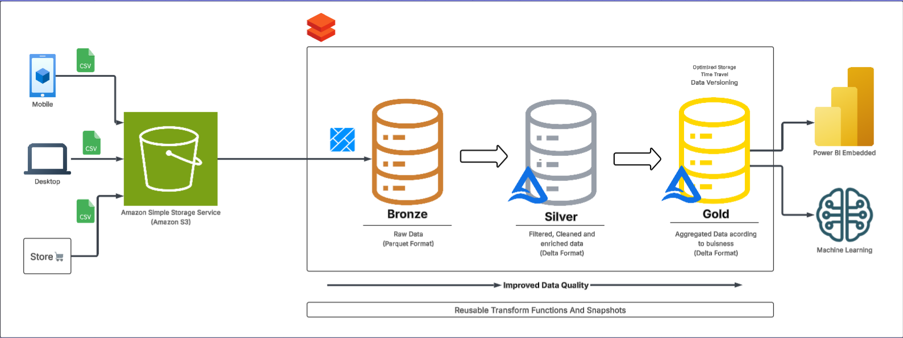
</p>


## 📁 Dataset & Input

<p align="center">
  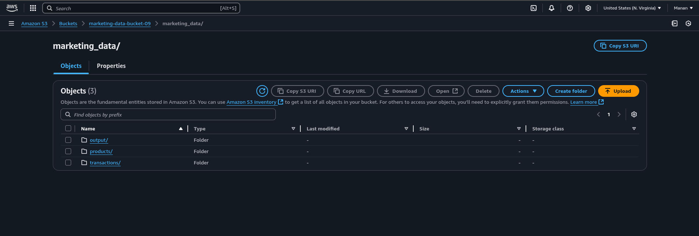
</p>
<p align="center">
  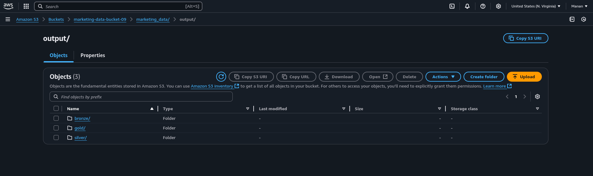
</p>

- Data is uploaded to Amazon S3 from three sources:
  - `web/transactions`
  - `mobile/transactions`
  - `instore/transactions`
- Product catalog is stored under:
  - `products/product_catalog.csv`


## 🥉 Bronze Layer - Raw Ingestion

### Objective:
Ingest CSV files from multiple S3 folders (web, mobile, instore), tag their origin using `withColumn("channel")`, and combine into a unified DataFrame. Then store it as a Delta Table (Bronze).

### Code:

```bash
pip install databricks-cli
databricks configure --token #you get via databricks access token
databricks secrets create-scope --scope aws-creds 
databricks secrets put --scope aws-creds --key aws-access-key
databricks secrets put --scope aws-creds --key aws-secret-key
```

```python
# Load AWS credentials securely from secret scope
ACCESS_KEY = dbutils.secrets.get(scope="aws-creds", key="aws-access-key")
SECRET_KEY = dbutils.secrets.get(scope="aws-creds", key="aws-secret-key")

# Set S3 access in Spark config
spark._jsc.hadoopConfiguration().set("fs.s3a.access.key", ACCESS_KEY)
spark._jsc.hadoopConfiguration().set("fs.s3a.secret.key", SECRET_KEY)
spark._jsc.hadoopConfiguration().set("fs.s3a.endpoint", "s3.amazonaws.com")
````

```python
from pyspark.sql.functions import lit

# Define S3 path
s3_base = "s3a://marketing-data-bucket-09/marketing_data"

# Input paths for each channel
web_path     = f"{s3_base}/transactions/web/"
mobile_path  = f"{s3_base}/transactions/mobile/"
instore_path = f"{s3_base}/transactions/instore/"

# Read & tag data
df_web     = spark.read.option("header", True).csv(web_path).withColumn("channel", lit("web"))
df_mobile  = spark.read.option("header", True).csv(mobile_path).withColumn("channel", lit("mobile"))
df_instore = spark.read.option("header", True).csv(instore_path).withColumn("channel", lit("instore"))

# Merge all sources
df_transactions = df_web.unionByName(df_mobile).unionByName(df_instore)

# Save to Bronze (raw format)
bronze_output = f"{s3_base}/output/bronze/transactions_bronze"
df_transactions.write.format("delta").mode("overwrite").save(bronze_output)
```
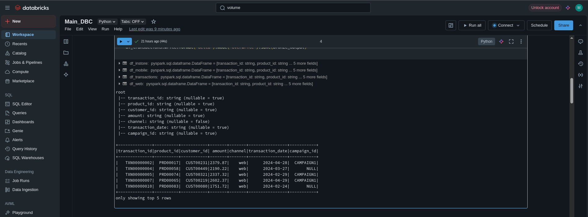

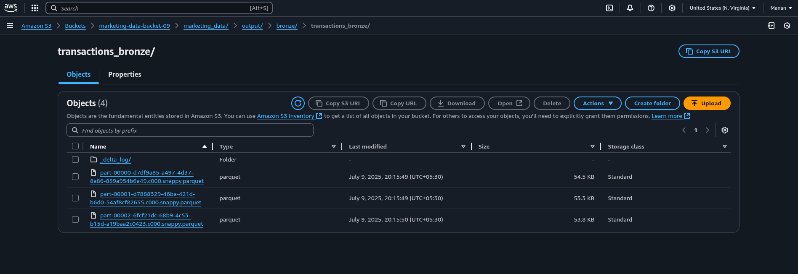


## 🥈 Silver Layer - Cleansed + Enriched

### Objective:

Join transaction records with the product catalog to enrich with product metadata. Filter out invalid rows (e.g., null product matches).

### Code:

```python
from pyspark.sql.functions import col
from delta.tables import *

# Set paths
bronze_path  = f"{s3_base}/output/bronze/transactions_bronze/"
product_path = f"{s3_base}/products/product_catalog.csv"
silver_path  = f"{s3_base}/output/silver/transactions_enriched"

# Read data
bronze_df  = spark.read.format("delta").load(bronze_path)
products_df = spark.read.option("header", True).csv(product_path)

# Joining + filter
silver_df = bronze_df.join(products_df, on="product_id", how="left")
silver_df_clean = silver_df.filter(col("product_name").isNotNull())

# Save to Silver
silver_df_clean.write.format("delta").mode("overwrite").save(silver_path)
```
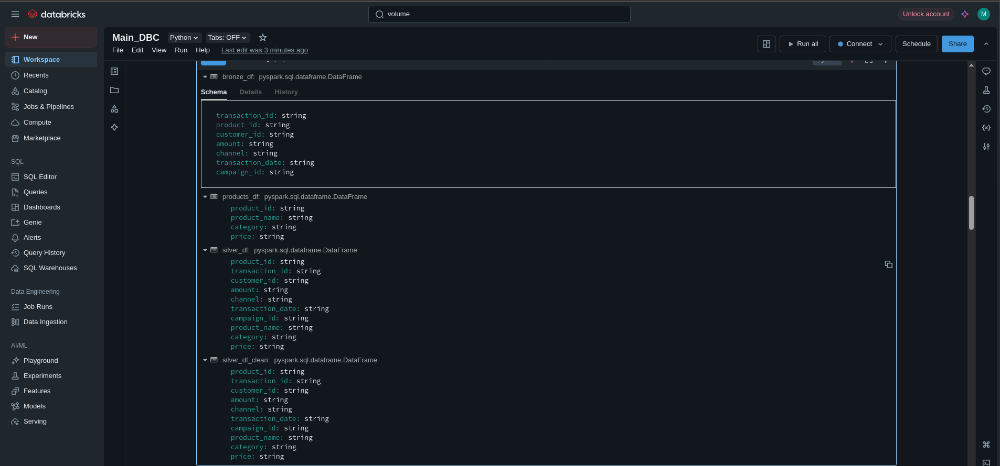
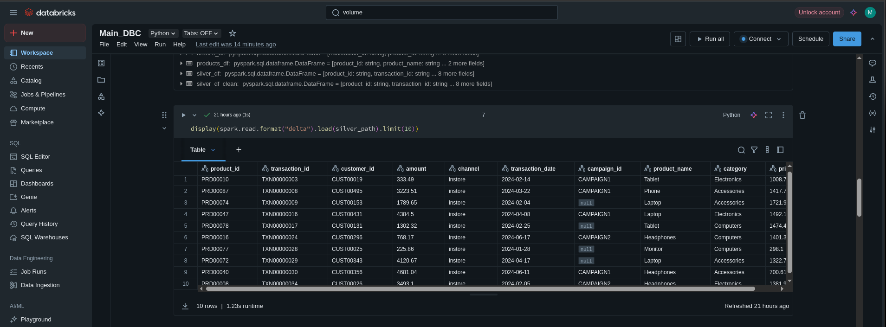
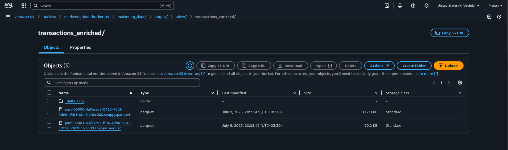


## 🧪 Data Quality Checks (Silver → Gold)

### Objective:

Before promoting enriched data from Silver to Gold, we validate data quality to ensure accurate analytics.

### Code:
```python
from pyspark.sql.functions import col

# Check for null values in transaction_id, product_id, and amount columns
null_counts = silver_df.select([
    col(c).isNull().cast("int").alias(c) for c in ["transaction_id", "product_id", "amount"]
]).groupBy().sum().collect()[0].asDict()

print("Null Check:")
for col_name, null_count in null_counts.items():
    print(f"{col_name}: {null_count} nulls")

# Check valid amount range (0–10,000)
out_of_range = silver_df.filter((col("amount") < 0) | (col("amount") > 10000)).count()
print(f"\nAmount out of range (0–10,000): {out_of_range} rows")

# Check for malformed product IDs (e.g., PRD1234)
invalid_products = silver_df.filter(~col("product_id").rlike("^PRD\\d{5}$")).count()
print(f"\nInvalid product_id format: {invalid_products} rows")

# Checking for Duplicate transaction IDs  
duplicate_txns = silver_df.groupBy("transaction_id").count().filter("count > 1").count()
print(f"\nDuplicate transaction_id: {duplicate_txns} rows")
``` 

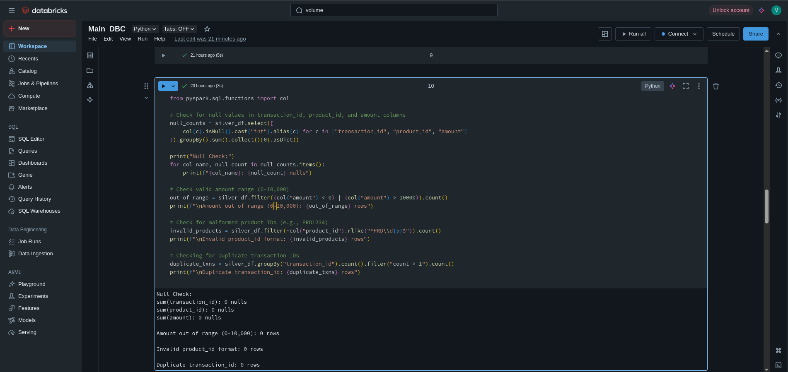

## 🥇 Gold Layer - Aggregated Analytics

### Objective:

Aggregate transactions per channel with total revenue and transaction count, useful for dashboards and ML.

### Code:

```python
from pyspark.sql import functions as F

# Reading Silver Table
silver_df = spark.read.format("delta").load("s3://marketing-data-bucket-09/marketing_data/output/silver/transactions_enriched")

# Some Business Aggregations for example
# Total revenue per channel and category
gold_df = silver_df.groupBy("channel", "category").agg(
    F.sum("amount").alias("total_revenue"),
    F.countDistinct("customer_id").alias("unique_customers"),
    F.count("*").alias("transaction_count")
)

# Write it into Gold Layer Delta Table
gold_df.write.format("delta") \
    .mode("overwrite") \
    .save("s3://marketing-data-bucket-09/marketing_data/output/gold/channel_category_summary")

# Register as a table for future BI tools
spark.sql("""
    CREATE TABLE IF NOT EXISTS channel_category_summary
    USING DELTA
    LOCATION 's3://marketing-data-bucket-09/marketing_data/output/gold/channel_category_summary'
""")
```

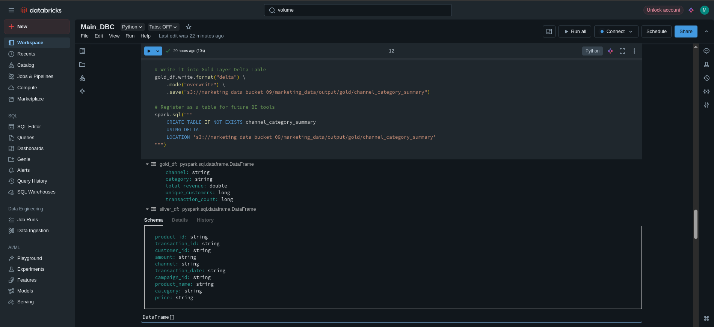
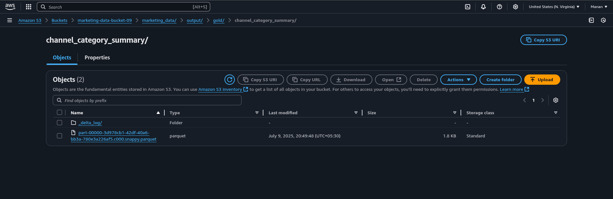

## ⚙️ Delta Optimization & Time Travel

### Objective:
Post-Gold generation, we optimize storage and performance using Delta Lake features:

 * OPTIMIZE to compact small files into fewer larger ones
 * VACUUM for clean up old data files not needed for time travel
 * Enable Time Travel to query historical versions

### Code: Delta Optimization
```python
# See commit history for the Delta table from gold layer
gold_table_path = "s3a://marketing-data-bucket-09/marketing_data/output/gold/channel_category_summary"

from delta.tables import DeltaTable

delta_table = DeltaTable.forPath(spark, gold_table_path)
delta_table.history().show(truncate=False)


from pyspark.sql import SparkSession

# Repointing to the gold delta table
gold_table_path = "s3a://marketing-data-bucket-09/marketing_data/output/gold/channel_category_summary"

# Reading current version 
df_latest = spark.read.format("delta").load(gold_table_path)
print("Current Version:")
df_latest.show()

# Reading specific version (like version 0)
df_v0 = spark.read.format("delta").option("versionAsOf", 0).load(gold_table_path)
print("Time Travel to Version 0:")
df_v0.show()

spark.sql(f"OPTIMIZE delta.`{gold_table_path}`")
spark.sql(f"VACUUM delta.`{gold_table_path}` RETAIN 168 HOURS") #retain for 7 days
```

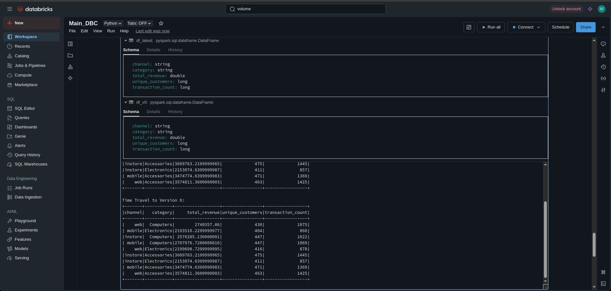


## 🧠 Learnings & Highlights

* ✅ Delta Lake architecture simplifies raw-to-insight data flow.
* 🔄 Time Travel & Versioning enables robust pipeline re-runs.
* 💎 Gold layer empowers BI tools with clean, aggregated insights.
* 🔐 Used `dbutils.secrets` to securely manage AWS credentials.


## 🔁 Reusability

All paths, secrets, and joins are parameterized and modular:

* Easily switch datasets by changing `s3_base`
* Join logic is extensible for new reference tables
* Delta format allows future schema evolution


## 📂 Folder Structure (S3)

```
/marketing_data/
├── transactions/
│   ├── web/
│   ├── mobile/
│   └── instore/
├── products/
│   └── product_catalog.csv
└── output/
    ├── bronze/
    ├── silver/
    └── gold/
```

## ✅ Final Output Table Sample (Gold Layer)

| channel | total\_transactions | total\_quantity | total\_revenue |
| ------- | ------------------- | --------------- | -------------- |
| web     | 1580                | 8902            | \$89,230.50    |
| mobile  | 1220                | 6201            | \$65,130.75    |
| instore | 1980                | 9803            | \$98,340.40    |


